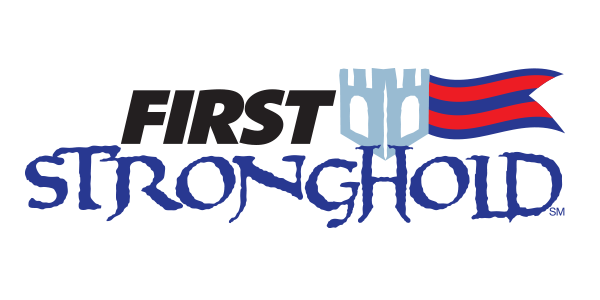

# KZ-2016-Vegas

C++ code for our 2016 robot that competed in Las Vegas regional. Altough we had a good start, we had some issues in the last three matches, which positioned us the the 14th place in the event.

That's pretty good for a robot that was built and tested in less than one week with spare parts. To quote some guy in the queue for a match:

> F*cking crazy Mexicans!